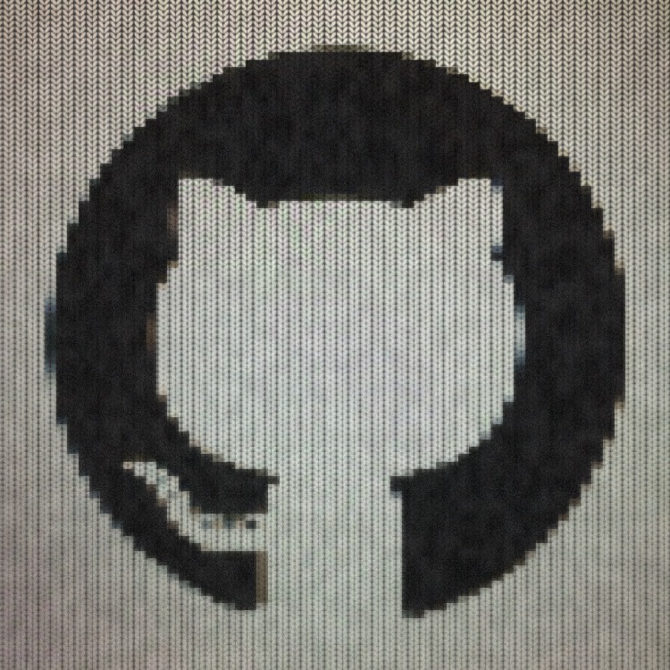

# Knitstagram
An iOS camera with a real time "knitted" filter built in 📷

The idea was to make a slighty conficurable "knitted" effect with a shader. It was quite fun so I decided to build a small camera app so that I could capture any photo with a knitted effect.

Screenshots
---
&nbsp;
&nbsp;
